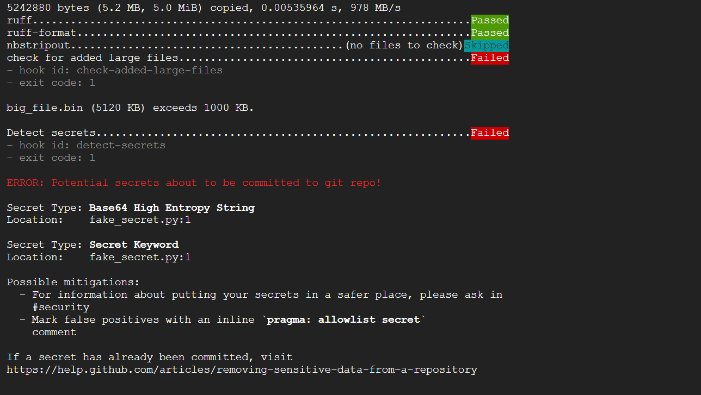
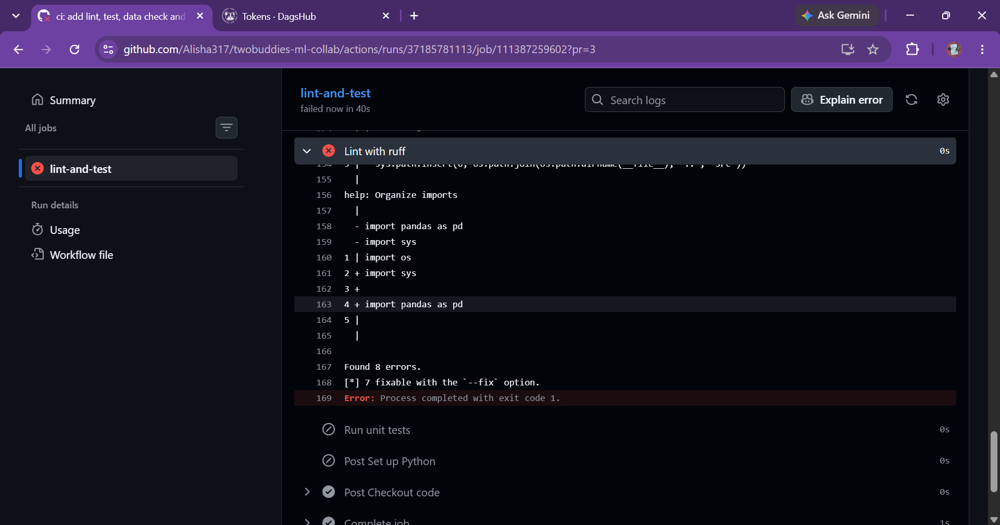
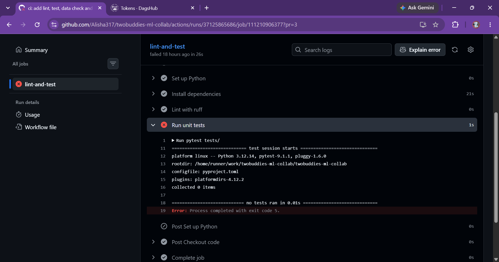

# REPORT

## Team
- Alisha (Member A): Data owner
- Saba Noreen (Member B): Model owner
- Dataset: Titanic (Kaggle train.csv), https://www.kaggle.com/c/titanic
- Repository: https://github.com/Alisha317/twobuddies-ml-collab

## Contributions

**Alisha (Member A):** Created the repository, scaffold and branch protection, added pre-commit hooks, versioned the dataset with DVC (DagsHub remote), updated the dataset, added the PR template, and reviewed teammate PRs.

**Saba Noreen (Member B):** Built the starter code, the EDA notebook and the reproducible pipeline (params.yaml, dvc.yaml, prepare/train/evaluate stages, fixed seeds, commit SHA logged in metrics.json). Ran the n_estimators experiments (50, 100, 200) and promoted the winner in PR 11. Wrote the CI workflow in PR 3 (ruff lint, pytest unit tests, DVC pull and repro, with the DagsHub credentials stored as a GitHub secret). Fixed the ruff lint errors and removed a broken test. Resolved the Step 10 params.yaml conflict by rebasing on dev (PR 15). Reviewed Alisha's PRs, including a "changes requested" review on PR 2. Wrote the Member B sections of this report.

## Reproducibility table

- Commit SHA: d2e77f7e12b11e0eb667b22d4d50100487cbdc55
- Final accuracy: 0.7528089887640449
- params.yaml:

    seed: 99
    split:
      test_size: 0.2
    train:
      model: random_forest
      n_estimators: 100
      max_depth: 4
- metrics.json:

    {
      "accuracy": 0.7528089887640449,
      "commit_sha": "82b3ed8478cddcfba951471402f344b08f1672d8"  # pragma: allowlist secret
    }
- Data pointer (data/raw/titanic.csv.dvc):

    outs:
    - md5: ddb7e53d06233fc5c65abd3a8a84c138
      size: 62745
      hash: md5
      path: titanic.csv
- Lock file: dvc.lock at the commit above
- Independent reproduction: Alisha cloned the repo fresh, checked out staging, installed dependencies, ran `dvc pull` and `dvc repro`, and posted metrics.json. The metrics matched.

## Experiments

Output of `dvc exp show`:

| Experiment                 | Created      | accuracy   | commit_sha                               | seed   | split.test_size   | train.model   | train.n_estimators   | train.max_depth   | data/processed/X_test.csv        | data/processed/X_train.csv       | data/processed/y_test.csv        | data/processed/y_train.csv       | data/raw/titanic.csv             | models/model.pkl                 | src/evaluate.py                  | src/features.py                  | src/prepare.py                   | src/train_model.py               |
|----------------------------|--------------|------------|------------------------------------------|--------|-------------------|---------------|----------------------|-------------------|----------------------------------|----------------------------------|----------------------------------|----------------------------------|----------------------------------|----------------------------------|----------------------------------|----------------------------------|----------------------------------|----------------------------------|
| workspace                  | -            | -          | -                                        | -      | -                 | -             | -                    | -                 | -                                | -                                | -                                | -                                | -                                | -                                | -                                | -                                | -                                | -                                |
| data/drop-missing-embarked | 05:10 AM     | -          | -                                        | -      | -                 | -             | -                    | -                 | -                                | -                                | -                                | -                                | -                                | -                                | -                                | -                                | -                                | -                                |
| data/initial-dataset       | Oct 03, 2026 | -          | -                                        | -      | -                 | -             | -                    | -                 | -                                | -                                | -                                | -                                | -                                | -                                | -                                | -                                | -                                | -                                |
| dev                        | 07:55 AM     | 0.81461    | 15b40d25340baad4602c222986aeceecdba0ad6f | 42     | 0.2               | random_forest | 100                  | 4                 | 3670c4a492e5aec71ffdabd76153c7e8 | 595e54bfc372125b4ffad5963d825bea | 2187c0b0065b72766897c0cdca70448b | 6332e3af3d41e2391378aee46009d948 | ddb7e53d06233fc5c65abd3a8a84c138 | 6b788a9c03bfb272b86593fe3b05e432 | 9274eb98d162408a9391a00ddaf63bd2 | bdcad8c11c716e44ffb02f72f08075fd | 1e607b00f78f0ebbbc5436a5ba9a31a4 | da8215bb5deb06ce9fe908f368da64ee |
| docs/report-draft          | 09:26 AM     | -          | -                                        | -      | -                 | -             | -                    | -                 | -                                | -                                | -                                | -                                | -                                | -                                | -                                | -                                | -                                | -                                |
| exp/memberB-estimators     | 07:08 AM     | 0.79888    | 207add87809e2d45b5d8302923b54e78bfdec31e | 42     | 0.2               | random_forest | 100                  | 6                 | 161454bbc91c3047f8213377fed916cf | e6ffbc06254b34d9de48686123335805 | 9013c44486e369a63ca7226075a95692 | 1bbe9ea4a99323d5d8e4d64a560cc322 | 61fdd54abdbf6a85b778e937122e1194 | cc6d5503e961e7586cc67202a400606d | a57860eb10b3346b87a2c6f9327e64cd | d7e4c19b0df73567ee868e9a0adec333 | 765c1c74cef861be444a64371bdce8b2 | dec453a5e618a5d9780c8dc741ca37b6 |
| ├── e7b9ec6 [nowed-bark]   | 07:09 AM     | 0.80337    | cd641c37fcfc3ee10627a79b7a78792acc76f21a | 42     | 0.2               | random_forest | 200                  | 6                 | cdc71e9199baf824294ad99c5b195eaa | 24425d08287013a845ce73ff7b8460ad | 36026b6df1933512db0cca4ee702f16d | 4cfacc80e44933ed36ae00ada26b7dd6 | ddb7e53d06233fc5c65abd3a8a84c138 | c40d289dc5415e835a920f51bcc97319 | a57860eb10b3346b87a2c6f9327e64cd | d7e4c19b0df73567ee868e9a0adec333 | 765c1c74cef861be444a64371bdce8b2 | f6303bac6182ba5539d86b716e259500 |
| ├── cc0c6b2 [ruddy-vela]   | 07:09 AM     | 0.81461    | cd641c37fcfc3ee10627a79b7a78792acc76f21a | 42     | 0.2               | random_forest | 100                  | 6                 | cdc71e9199baf824294ad99c5b195eaa | 24425d08287013a845ce73ff7b8460ad | 36026b6df1933512db0cca4ee702f16d | 4cfacc80e44933ed36ae00ada26b7dd6 | ddb7e53d06233fc5c65abd3a8a84c138 | 37af79f87b486ee927f73e5eaadb6ad8 | a57860eb10b3346b87a2c6f9327e64cd | d7e4c19b0df73567ee868e9a0adec333 | 765c1c74cef861be444a64371bdce8b2 | f6303bac6182ba5539d86b716e259500 |
| └── 20ad79c [lived-vies]   | 07:09 AM     | 0.80899    | cd641c37fcfc3ee10627a79b7a78792acc76f21a | 42     | 0.2               | random_forest | 50                   | 6                 | cdc71e9199baf824294ad99c5b195eaa | 24425d08287013a845ce73ff7b8460ad | 36026b6df1933512db0cca4ee702f16d | 4cfacc80e44933ed36ae00ada26b7dd6 | ddb7e53d06233fc5c65abd3a8a84c138 | 853e0a2407cf2cbd48b291adf541301a | a57860eb10b3346b87a2c6f9327e64cd | d7e4c19b0df73567ee868e9a0adec333 | 765c1c74cef861be444a64371bdce8b2 | f6303bac6182ba5539d86b716e259500 |
| feat/ci                    | 08:02 AM     | 0.79888    | 207add87809e2d45b5d8302923b54e78bfdec31e | 42     | 0.2               | random_forest | 100                  | 6                 | 161454bbc91c3047f8213377fed916cf | e6ffbc06254b34d9de48686123335805 | 9013c44486e369a63ca7226075a95692 | 1bbe9ea4a99323d5d8e4d64a560cc322 | 61fdd54abdbf6a85b778e937122e1194 | cc6d5503e961e7586cc67202a400606d | a57860eb10b3346b87a2c6f9327e64cd | d7e4c19b0df73567ee868e9a0adec333 | 765c1c74cef861be444a64371bdce8b2 | dec453a5e618a5d9780c8dc741ca37b6 |
| feat/dvc-pipeline          | 06:43 AM     | 0.79888    | 207add87809e2d45b5d8302923b54e78bfdec31e | 42     | 0.2               | random_forest | 100                  | 6                 | 161454bbc91c3047f8213377fed916cf | e6ffbc06254b34d9de48686123335805 | 9013c44486e369a63ca7226075a95692 | 1bbe9ea4a99323d5d8e4d64a560cc322 | 61fdd54abdbf6a85b778e937122e1194 | cc6d5503e961e7586cc67202a400606d | a57860eb10b3346b87a2c6f9327e64cd | d7e4c19b0df73567ee868e9a0adec333 | 765c1c74cef861be444a64371bdce8b2 | dec453a5e618a5d9780c8dc741ca37b6 |
| feat/eda-notebook          | Oct 03, 2026 | -          | -                                        | -      | -                 | -             | -                    | -                 | -                                | -                                | -                                | -                                | -                                | -                                | -                                | -                                | -                                | -                                |
| feat/import-starter-code   | Oct 03, 2026 | -          | -                                        | -      | -                 | -             | -                    | -                 | -                                | -                                | -                                | -                                | -                                | -                                | -                                | -                                | -                                | -                                |
| feat/pr-template           | 05:10 AM     | -          | -                                        | -      | -                 | -             | -                    | -                 | -                                | -                                | -                                | -                                | -                                | -                                | -                                | -                                | -                                | -                                |
| feat/pre-commit            | Oct 03, 2026 | -          | -                                        | -      | -                 | -             | -                    | -                 | -                                | -                                | -                                | -                                | -                                | -                                | -                                | -                                | -                                | -                                |
| feat/promote-best-params   | 09:11 AM     | 0.75281    | 82b3ed8478cddcfba951471402f344b08f1672d8 | 99     | 0.2               | random_forest | 100                  | 4                 | f04e8f7e7d9fa5295d38a25839340cd1 | 7cf49767c384c8d460beb03400b6d936 | 0b5f4a597df5f9854915c544c635580d | a460c3c4b232cfa3bba8f7586b501cee | ddb7e53d06233fc5c65abd3a8a84c138 | e2dc95b687b157f7d0b3890d40022011 | 48f61051ed82a442ba13295aafb39eb6 | d7e4c19b0df73567ee868e9a0adec333 | b68f945d643838a739bfd394169552a0 | 2b23ff37c2b0dcca2de3fdb63d4d8685 |
| feat/update-split-B        | 08:56 AM     | 0.75281    | 82b3ed8478cddcfba951471402f344b08f1672d8 | 99     | 0.2               | random_forest | 100                  | 4                 | f04e8f7e7d9fa5295d38a25839340cd1 | 7cf49767c384c8d460beb03400b6d936 | 0b5f4a597df5f9854915c544c635580d | a460c3c4b232cfa3bba8f7586b501cee | ddb7e53d06233fc5c65abd3a8a84c138 | e2dc95b687b157f7d0b3890d40022011 | 48f61051ed82a442ba13295aafb39eb6 | d7e4c19b0df73567ee868e9a0adec333 | b68f945d643838a739bfd394169552a0 | 2b23ff37c2b0dcca2de3fdb63d4d8685 |
| model-v1.0                 | Oct 03, 2026 | -          | -                                        | -      | -                 | -             | -                    | -                 | -                                | -                                | -                                | -                                | -                                | -                                | -                                | -                                | -                                | -                                |

Saba (n_estimators 50, 100, 200): winner n_estimators=100 with accuracy 0.8146, the best of the three runs. Promoted in PR 11: https://github.com/Alisha317/twobuddies-ml-collab/pull/11

An abandoned experiment branch is kept for reference: `exp/memberB-estimators`.

## Links

- Data-update PR: https://github.com/Alisha317/twobuddies-ml-collab/pull/8
- Conflict-resolution PR (Step 10): https://github.com/Alisha317/twobuddies-ml-collab/pull/15
- "Changes requested" review: https://github.com/Alisha317/twobuddies-ml-collab/pull/2
- CI PR: https://github.com/Alisha317/twobuddies-ml-collab/pull/3
- Promote best params PR: https://github.com/Alisha317/twobuddies-ml-collab/pull/11
- Alisha's max_depth PR: https://github.com/Alisha317/twobuddies-ml-collab/pull/14
- Report PR: https://github.com/Alisha317/twobuddies-ml-collab/pull/9

**Conflict resolution (Step 10):** Alisha set seed to 7 and Saba set seed to 99 on the same line of params.yaml, starting from the same dev commit. Alisha's PR was merged first. Saba rebased on origin/dev, Git reported a conflict in params.yaml, Saba kept seed 99, ran `dvc repro` to regenerate dvc.lock and metrics.json, and pushed with `--force-with-lease`.

## Screenshots

Blocked large file and secret (pre-commit):

Failing CI check (PR 3):

## Retrospective

**What broke:**
1. dvc.lock and metrics.json caused merge conflicts several times. They are generated files, so we took one side and regenerated them with `dvc repro`.
2. An overly broad .gitignore pattern excluded the DVC pointer files. We narrowed it.
3. requirements.txt became bloated with unneeded packages. We trimmed it to what the project uses.
4. CI failed on ruff (unsorted imports, a blind except, E402 in notebooks) and on pytest (no tests found, then a broken test). We fixed the imports, caught specific exceptions, ignored E402 for notebooks, and removed the broken test.
5. CI could not pull data until the DVC remote credentials were added as a GitHub secret.
6. An unfinished merge blocked switching branches, so we finished it first.

**What we added to CONTRIBUTING.md because of it:**
- Never hand-merge dvc.lock or metrics.json. Resolve source files first, then run `dvc repro`.
- Run `dvc push` before `git push` whenever data or models change.
- Run `pre-commit run --all-files` before opening a PR.
